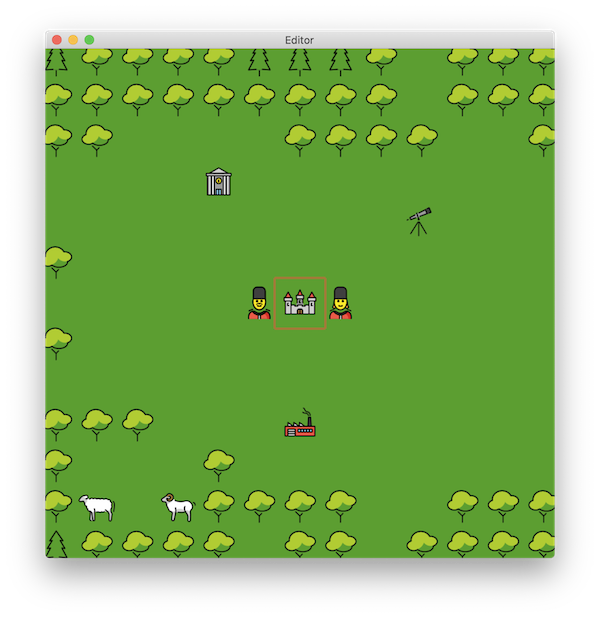

# 🧙‍♀️ Emoji Quest 🧝‍♂️

<nobr>🌈 <b>Mojick</b></nobr> has faded from the world.
<nobr>🐉 <b>Mojical creatures</b> 🦄</nobr> have been lost for an <nobr>age 🕰</nobr>.
You, <nobr>😬 <b>Adventurer</b> 😲</nobr>, are charged to wander the
<nobr>🎲 <b>Faces of Daia</b> 🎲</nobr> to find and restore the
<nobr><b>💨 essences 💦 of 🔥 mojick ⚡️</b></nobr>,
<nobr>❓ interrogating</nobr>,
<nobr>🪓 harvesting</nobr>,
<nobr>✂️ crafting</nobr>, and,
where the cause is just,
<nobr>⚔️ fighting</nobr>
<b>emojis</b> to restore mojick to all the lands.

Emoji Quest is in development and brought to you by the makers of [Escape
Peruácru Island][peruacru], [BØRK: Escape the Scandinavian Home Furnishings
Labyrinth][bork], a [weird color picker][color], an [Elvish][elvish]
transcriber, an Elvish interactive [Map of Middle-Earth][elfmap], and some
[influential][q] JavaScript [stuff][commonjs].
⚠️&nbsp;May contain puns&nbsp;⚠️.

* 🎮 [Discord Chat][discord]
* 📈 [Spreadsheets][spreadsheets]
* 🕷 [Web Page][web]
* 🦞 [Lobster Language][lobster]
* 🧛‍♂️ [Patreon Donations][patreon]

# 🏗👷‍♀️ Contributing 👷‍♂️🚧

Use [direnv](https://direnv.net/) to automatically set up your PATH when
working within the EmojiQuest repository.
All further instructions assume `scripts` and `lobster/bin` are on your path.

Run `build-lobster` to create the required `lobster` binary.
You may need to `git checkout HEAD lobster` afterward to restore a clean
working copy since building lobster alters checked-in artifacts.

Run `generate-assets` to build the sprite atlas and other game code from game
data.

Run `edice` to edit the tile map of Daia, the world of EmojiQuest.

[Lobster][lobster], [OpenMoji][openmoji], and game data [spreadsheets] are
checked in.

To update Lobster, run `update-lobster [ref]`.
Run `build-lobster`.

To update Openmoji, run `update-openmoji [ref]`.
Run `generate-assets` to update the sprite atlas.

To update spreadsheets, download the [spreadsheets] into the `data` directory.
Run `generate-assets` to update generated code.

  [peruacru]: https://peruacru.then.land
  [bork]: http://børk.com
  [color]: http://color.codi.sh
  [elvish]: https://tengwar.3rin.gs
  [elfmap]: http://3rin.gs
  [q]: https://www.npmjs.com/package/q
  [commonjs]: http://wiki.commonjs.org/wiki/Modules/1.1

  [discord]: https://discordapp.com/channels/692076552514699426/692076553017884723
  [spreadsheets]: https://docs.google.com/spreadsheets/d/1U8JJM-g7Br0ePrjH7kg7tJ3N2eb0Mab2y5GDiJo1Tx8/edit#gid=97282066
  [web]: https://github.com/borkshop/emojiquest.app
  [lobster]: http://strlen.com/lobster/
  [patreon]: https://www.patreon.com/kriskowal
  [openmoji]: https://openmoji.org
